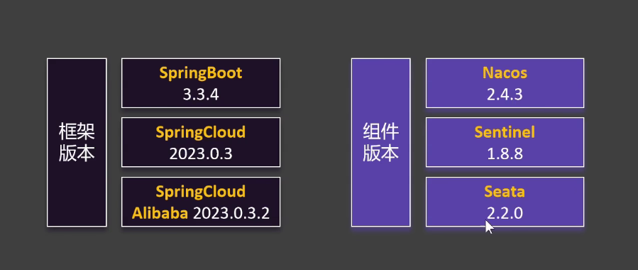
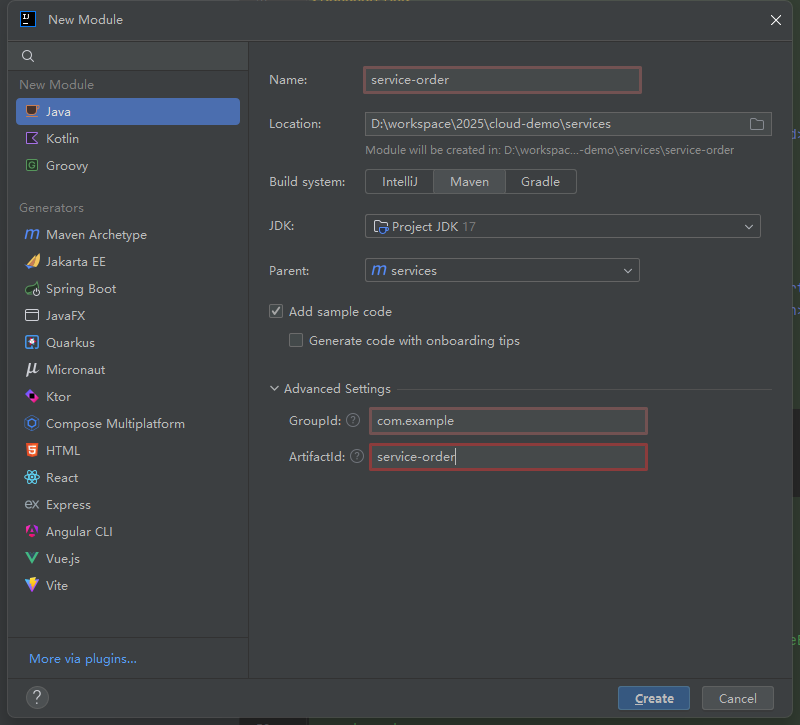
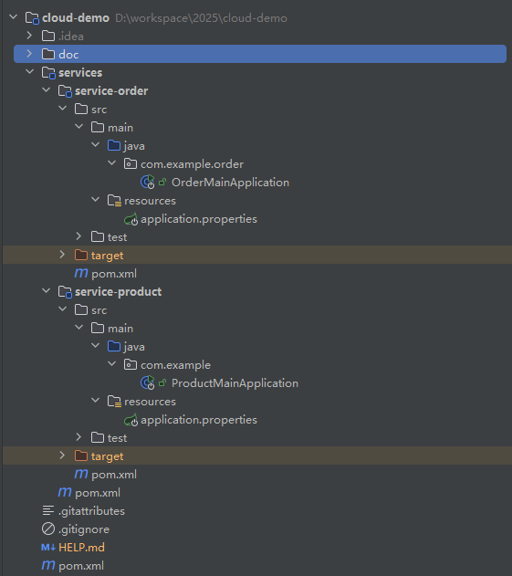
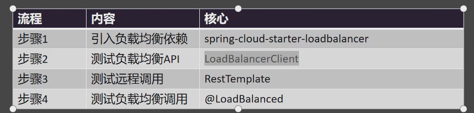
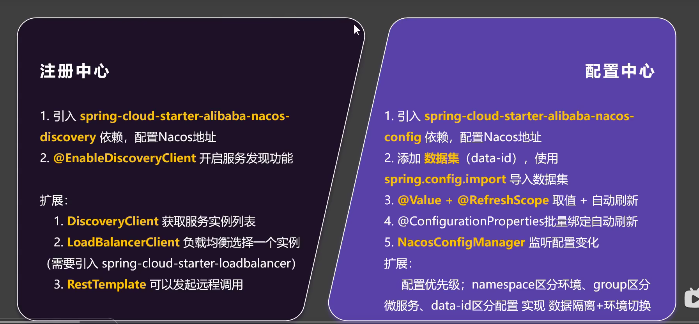

# 尚硅谷阿里巴巴微服务快速通关
> 基于尚硅谷快速通过阿里巴巴微服务架构：[相关文档点击这里](https://www.yuque.com/leifengyang/sutong/oz4gbyh5maa0rmxu)
## 版本对比

## 创建 cloud-demo 和 service 管理两个服务
创建模块

整体模块 

### 具体流程在 [Nacos 服务注册与发现.md](Nacos%20%E6%9C%8D%E5%8A%A1%E6%B3%A8%E5%86%8C%E4%B8%8E%E5%8F%91%E7%8E%B0.md)

远程调用负载均衡

nacos 总结
