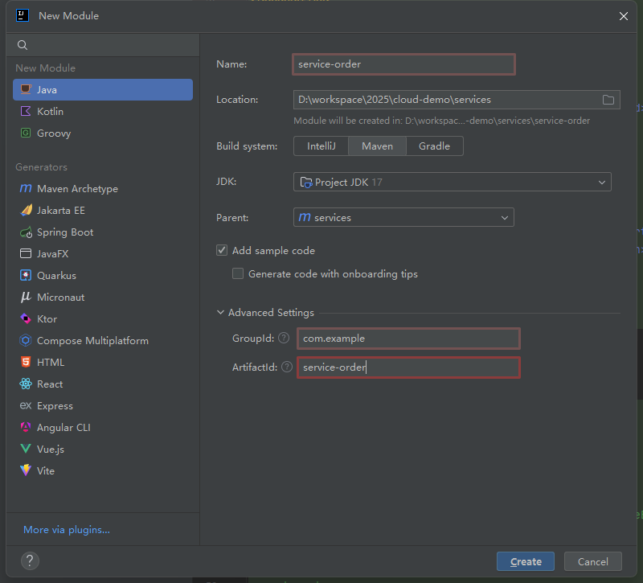
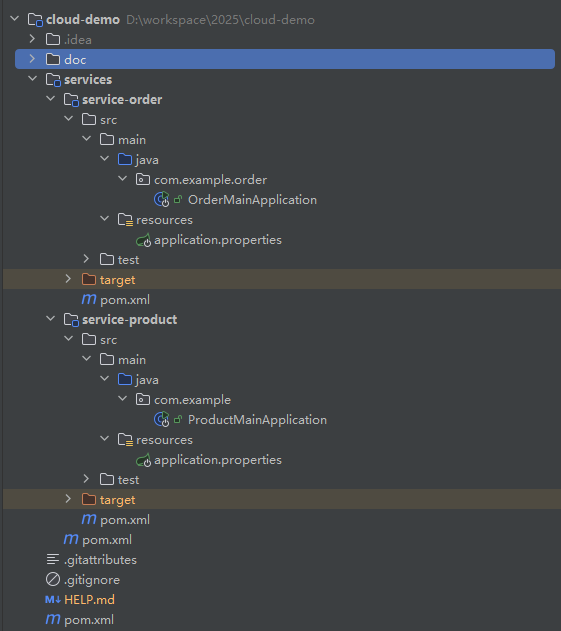
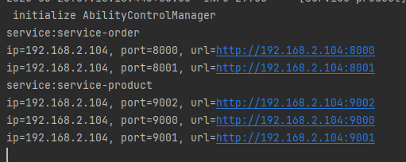

# 尚硅谷阿里巴巴微服务快速通关

## 版本对比


## 创建 cloud-demo 和 service 管理两个服务
创建模块


整体模块 



### cloud-demo pom文件详情
```xml
<!--springboot 版本-->
<parent>
    <groupId>org.springframework.boot</groupId>
    <artifactId>spring-boot-starter-parent</artifactId>
    <version>3.3.4</version>
    <relativePath/> <!-- lookup parent from repository -->
</parent>
<!--打包方式-->
<packaging>pom</packaging>
<!--版本确定-->
<properties>
    <maven.compiler.source>17</maven.compiler.source>
    <maven.compiler.target>17</maven.compiler.target>
    <project.build.sourceEncoding>UTF-8</project.build.sourceEncoding>
    <spring-cloud.version>2023.0.3</spring-cloud.version>
    <spring-cloud-alibaba.version>2023.0.3.2</spring-cloud-alibaba.version>
</properties>
<!--依赖管理-->
<dependencyManagement>
    <dependencies>
        <dependency>
            <groupId>org.springframework.cloud</groupId>
            <artifactId>spring-cloud-dependencies</artifactId>
            <version>${spring-cloud.version}</version>
            <type>pom</type>
            <scope>import</scope>
        </dependency>
        <dependency>
            <groupId>com.alibaba.cloud</groupId>
            <artifactId>spring-cloud-alibaba-dependencies</artifactId>
            <version>${spring-cloud-alibaba.version}</version>
            <type>pom</type>
            <scope>import</scope>
        </dependency>
    </dependencies>
</dependencyManagement>
```
### service pom 文件详情
```xml
<!--打包方式-->
<packaging>pom</packaging>
<!--版本确定-->
<properties>
    <maven.compiler.source>17</maven.compiler.source>
    <maven.compiler.target>17</maven.compiler.target>
    <project.build.sourceEncoding>UTF-8</project.build.sourceEncoding>
</properties>
<!--nacos依赖-->
<dependencies>
    <dependency>
        <groupId>com.alibaba.cloud</groupId>
        <artifactId>spring-cloud-starter-alibaba-nacos-discovery</artifactId>
    </dependency>
    <dependency>
        <groupId>org.springframework.cloud</groupId>
        <artifactId>spring-cloud-starter-openfeign</artifactId>
    </dependency>
    <dependency>
        <groupId>org.springframework.boot</groupId>
        <artifactId>spring-boot-starter-web</artifactId>
    </dependency>
</dependencies>
```
## nacos 注册发现

创建一个主启动
```java
@SpringBootApplication
public class OrderMainApplication {

    public static void main(String[] args) {
        System.out.println("Hello, World!");
        SpringApplication.run(OrderMainApplication.class, args);
    }
}
```
创建一个配置
```properties
spring.application.name=service-order
server.port=8000

spring.cloud.nacos.discovery.server-addr=127.0.0.1:8848
```
集群效果，修改端口号启动服务


nacos 效果


## nacos 服务发现

- 注解 @EnableDiscveryClient
- 对象 DiscoveryClient 或 NacosServiceDiscovery

### 方法1：产品服务类添加注解@EnableDiscveryClient 
```java
@EnableDiscoveryClient //服务发现
@SpringBootApplication
public class ProductMainApplication {
    public static void main(String[] args) {
        System.out.println("Hello, World!");
        SpringApplication.run(ProductMainApplication.class, args);
    }
}
```

### 方法2：代码的方式获取服务相关信息，product test 创建一个 DiscoveryTest 测试类
可以使用 DiscoveryClient 或 NacosServiceDiscovery
```java
@SpringBootTest
public class DiscoveryTest {
    @Autowired
    DiscoveryClient discoveryClient;

    @Autowired
    NacosServiceDiscovery nacosServiceDiscovery;

    @Test
    void nacosServiceTest() throws NacosException {
        for (String service : nacosServiceDiscovery.getServices()) {
            System.out.println("service:" + service);
            nacosServiceDiscovery.getInstances(service).forEach(instance -> {
                System.out.println("ip=" + instance.getHost() + ", port=" + instance.getPort() + ", url=" + instance.getUri());
            });
        }

    }

    @Test
    public void test() {
        for (String service : discoveryClient.getServices()) {
            System.out.println("service:" + service);
            List<ServiceInstance> instances = discoveryClient.getInstances(service);
            instances.forEach(instance -> {
                System.out.println("ip="+instance.getHost() + ", port=" + instance.getPort() + ", url=" + instance.getUri());
            });
        }
    }
}
```
输出结果

